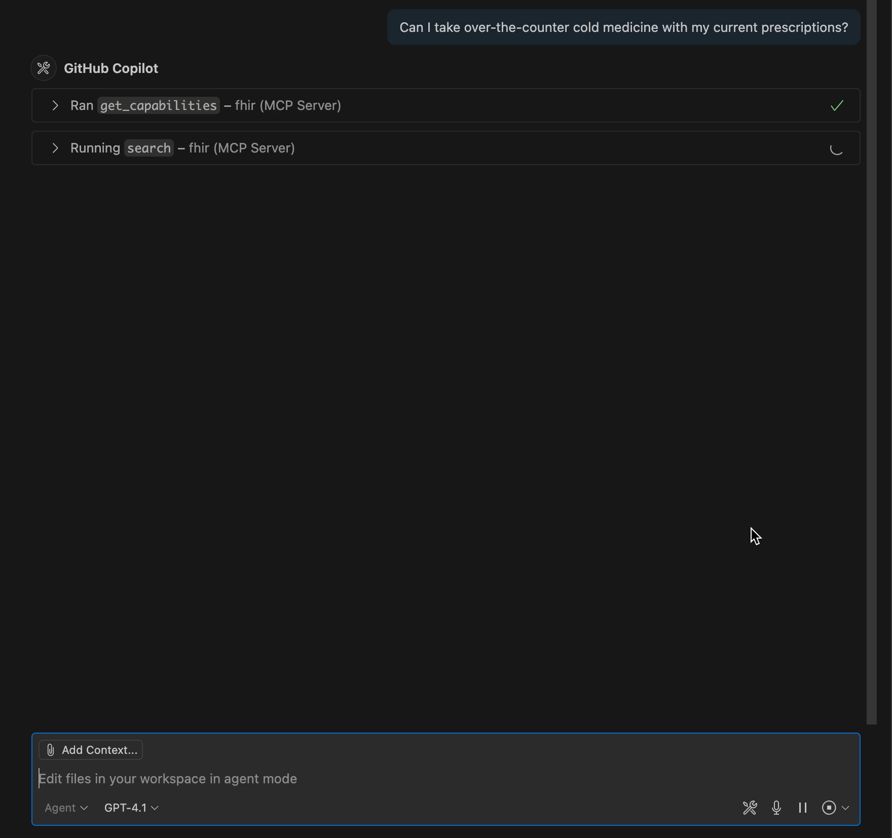
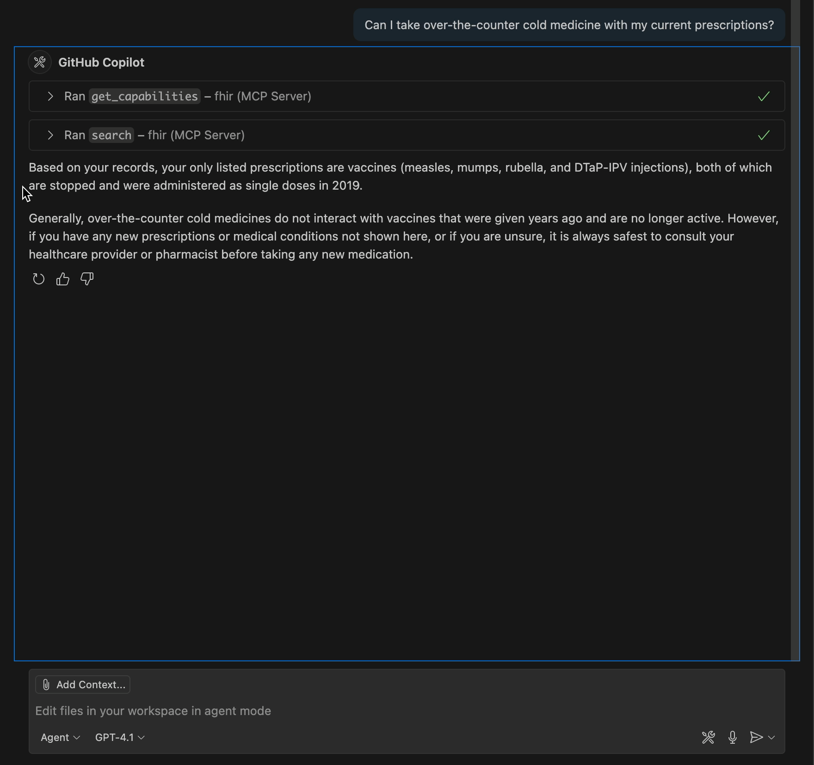

# Model Context Protocol (MCP) Server for Fast Healthcare Interoperability Resources (FHIR)

[](https://github.com/wso2/fhir-mcp-server/blob/main/LICENSE)
[](https://stackoverflow.com/questions/tagged/wso2)
[](https://discord.com/invite/wso2)
[](https://twitter.com/intent/follow?screen_name=wso2)

## Overview

The MCP Server for FHIR is a Python-based service that provides seamless, standardized access to FHIR data from any compatible FHIR server. Designed for developers, integrators, and healthcare innovators, this server acts as a bridge between modern AI/LLM tools and healthcare data, making it easy to search, retrieve, and analyze clinical information.

**Key features:**
- **Flexible Integration:** Use the server from the command line, in Docker, or directly within tools like VS Code, Claude Desktop, and MCP Inspector.
- **Natural Language FHIR Search:** Query for patients, allergies, immunizations, care plans, and more using simple prompts or programmatic requests.
- **Configurable & Secure:** Easily connect to any FHIR server, with support for environment-based configuration and secure access tokens.
- **Developer Friendly:** Quick setup with modern Python tooling (`uv`), clear documentation, and ready-to-use integration examples for rapid prototyping and deployment.

Whether you are building healthcare applications, integrating with AI assistants, or exploring clinical datasets, the MCP server provides a robust foundation for accessing and working with FHIR data in a standardized, extensible way.

## Prerequisites
- Python 3.8+
- [uv](https://github.com/astral-sh/uv) (for dependency management)
- An accessible FHIR server (defaults to the public HAPI FHIR test server)

## Setup

1. **Clone the repository:**
    ```bash
    git clone <repository_url>
    cd <repository_directory>
    ```
2. **Create a virtual environment and install dependencies:**
    ```bash
    uv venv
    source .venv/bin/activate
    uv pip sync requirements.txt
    ```
    Or with pip:
    ```bash
    python -m venv .venv
    source .venv/bin/activate
    pip install -r requirements.txt
    ```
3. **Configure Environment Variables:**
    Copy the example file and customize if needed:
    ```bash
    cp .env.example .env
    ```

## Configuration

### CLI Options

You can customize the behavior of the MCP server using the following command-line flags:

- **--transport**
    - Description: Specifies the transport protocol used by the MCP server to communicate with clients.
    - Accepted values: stdio, sse, streamable-http
    - Default: streamable-http

- **--log-level**
    - Description: Sets the logging verbosity level for the server.
    - Accepted values: DEBUG, INFO, WARN, ERROR (case-insensitive)
    - Default: INFO

- **--disable-mcp-auth**
    - Description: Disables OAuth2-based authentication between the MCP client (e.g., Claude Desktop or VSCode) and the MCP server.
    - Type: Flag (no value required)
    - Default: False (authentication enabled)

- **--disable-fhir-auth**
    - Description: Disables OAuth2-based authentication between the MCP server and the FHIR server.
    - Type: Flag (no value required)
    - Default: False (authentication enabled)

Sample Usages:

```shell
uv run fhir-mcp-server --transport streamable-http --log-level DEBUG --disable-mcp-auth --disable-fhir-auth
```

### Environment Variables

**MCP Server Configurations:**
- `HEALTHCARE_MCP_HOST`: The hostname or IP address the MCP server should bind to (e.g., 0.0.0.0 for all interfaces, or localhost for local-only access).
- `HEALTHCARE_MCP_PORT`: The port on which the MCP server will listen for incoming client requests (e.g., 8000).

**MCP Server OAuth2 Configuration (MCP Client ↔ MCP Server):**
These variables are used when securing communication between an MCP client (like Claude Desktop or VSCode) and the MCP server via OAuth2 Authorization Code Grant flow.

- `HEALTHCARE_MCP_OAUTH__CLIENT_ID`: The OAuth2 client ID registered with your Identity Provider to authenticate MCP clients.
- `HEALTHCARE_MCP_OAUTH__CLIENT_SECRET`: The OAuth2 client secret used to verify the MCP client during the token exchange process.
- `HEALTHCARE_MCP_OAUTH__METADATA_URL`: The URL to the Identity Provider’s OAuth2 discovery document (usually ending in .well-known/openid-configuration). Used to dynamically fetch token and authorization endpoints.

**FHIR Backend Configuration (MCP Server ↔ FHIR Server):**
These variables configure the MCP server’s secure connection with the FHIR backend using authorization code grant flow.

- `HEALTHCARE_MCP_FHIR__CLIENT_ID`: The OAuth2 client ID used by the MCP server to authenticate itself to the FHIR server.
- `HEALTHCARE_MCP_FHIR__CLIENT_SECRET`: The client secret corresponding to the FHIR client ID. Used during token exchange.
- `HEALTHCARE_MCP_FHIR__BASE_URL`: The base URL of the FHIR server (e.g., https://hapi.fhir.org/baseR4). This is used to generate tool URIs and to route FHIR requests.
- `HEALTHCARE_MCP_FHIR__SCOPE`: A space-separated list of OAuth2 scopes to request from the FHIR authorization server (e.g., user/Patient.read user/Observation.read). 


## Usage

Run the server:
```bash
uv run fhir-mcp-server
```

You can also run the server directly from the PyPI package (without cloning the repository) using:

```bash
uvx fhir-mcp-server
```

Check available server options:
```bash
uvx run fhir-mcp-server --help
```

## Running Tests

To run the tests and ensure your development environment is set up correctly:

1. **Install test dependencies** (if you haven't already):
    ```bash
    uv pip install '.[test]'
    ```

2. **Run the tests:**
    ```bash
    pytest tests/
    ```
    This will discover and run all tests in the `tests/` directory.


## VS Code Integration

[](https://insiders.vscode.dev/redirect/mcp/install?name=fhir&config=%7B%22type%22%3A%22http%22%2C%22url%22%3A%22http%3A%2F%2Flocalhost%3A8000%2Fmcp%2F%22%7D)
[](https://insiders.vscode.dev/redirect/mcp/install?name=fhir&config=%7B%22type%22%3A%22http%22%2C%22url%22%3A%22http%3A%2F%2Flocalhost%3A8000%2Fmcp%2F%22%7D)

Add the following JSON block to your User Settings (JSON) file in VS Code (> V1.101). You can do this by pressing Ctrl + Shift + P and typing Preferences: Open User Settings (JSON).

<table>
<tr><th>Streamable HTTP</th><th>SSE</th><th>STDIO</th></tr>
<tr valign=top>
<td>

```json
"mcp": {
    "servers": {
        "fhir": {
            "type": "http",
            "url": "http://localhost:8000/mcp/",
        }
    }
}
```
</td>
<td>

```json
"mcp": {
    "servers": {
        "fhir": {
            "type": "sse",
            "url": "http://localhost:8000/sse/",
        }
    }
}
```
</td>
<td>

```json
"mcp": {
    "servers": {
        "fhir": {
            "command": "uv",
            "args": [
                "--directory",
                "/path/to/fhir-mcp-server",
                "run",
                "fhir-mcp-server",
                "--transport",
                "stdio"
            ],
            "env": {
                "HEALTHCARE_MCP_FHIR__ACCESS_TOKEN": "Your FHIR Access Token"
            }
        }
    }
}
```
</td>
</tr>
</table>

## Claude Desktop Integration
Add the following JSON block to your Claude Desktop settings to connect to your local MCP server. 
 - Launch the Claude Desktop app, click on the Claude menu in the top bar, and select "Settings…".
 - In the Settings pane, click “Developer” in the left sidebar. Then click "Edit Config". This will open your configuration file in your file system. If it doesn’t exist yet, Claude will create one automatically at:
    - macOS: ~/Library/Application Support/Claude/claude_desktop_config.json
    - Windows: %APPDATA%\Claude\claude_desktop_config.json
 - Open the claude_desktop_config.json file in any text editor. Replace its contents with the following JSON block to register the MCP server:

<table>
<tr><th>Streamable HTTP</th><th>SSE</th></tr><th>STDIO</th></tr>
<tr valign=top>
<td>

```json
{
    "mcpServers": {
        "fhir": {
            "command": "npx",
            "args": [
                "-y",
                "mcp-remote",
                "http://localhost:8000/mcp"
            ]
        }
    }
}
```
</td>
<td>

```json
{
    "mcpServers": {
        "fhir": {
            "command": "npx",
            "args": [
                "-y",
                "mcp-remote",
                "http://localhost:8000/sse"
            ]
        }
    }
}
```
</td>
<td>

```json
{
    "mcpServers": {
        "fhir": {
            "command": "uv",
            "args": [
                "--directory",
                "/path/to/fhir-mcp-server",
                "run",
                "fhir-mcp-server",
                "--transport",
                "stdio"
            ],
            "env": {
                "HEALTHCARE_MCP_FHIR__ACCESS_TOKEN": "Your FHIR Access Token"
            }
        }
    }
}
```
</td>
</tr>
</table>

## MCP Inspector Integration
Follow these steps to get the MCP Inspector up and running:

- Open a terminal and run the following command:
    
    `npx -y @modelcontextprotocol/inspector`

- In the MCP Inspector interface:
<table>
<tr><th>Streamable HTTP</th><th>SSE</th><th>STDIO</th></tr>
<tr valign=top>
<td>

- Transport Type: `Streamable HTTP`
- URL: `http://localhost:8000/mcp`
</td>
<td>

- Transport Type: `SSE`
- URL: `http://localhost:8000/sse`
</td>
<td>

- Transport Type: `STDIO`
- Command: `uv`
- Arguments: `--directory /path/to/fhir-mcp-server run fhir-mcp-server --transport stdio`
</td>
</tr>
</table>

Make sure your MCP server is already running and listening on the above endpoint.

Once connected, MCP Inspector will allow you to visualize tool invocations, inspect request/response payloads, and debug your tool implementations easily.

## Tools

- `get_capabilities`: Retrieves metadata about a specified FHIR resource type, including its supported search parameters and custom operations.
    - `type`: The FHIR resource type name (e.g., "Patient", "Observation", "Encounter")

- `search`: Executes a standard FHIR search interaction on a given resource type, returning a bundle or list of matching resources.
    - `type`: The FHIR resource type name (e.g., "MedicationRequest", "Condition", "Procedure").
    - `searchParam`: A mapping of FHIR search parameter names to their desired values (e.g., {"family":"Simpson","birthdate":"1956-05-12"}).

- `read`: Performs a FHIR "read" interaction to retrieve a single resource instance by its type and resource ID, optionally refining the response with search parameters or custom operations.
    - `type`: The FHIR resource type name (e.g., "DiagnosticReport", "AllergyIntolerance", "Immunization").
    - `id`: The logical ID of a specific FHIR resource instance.
    - `searchParam`: A mapping of FHIR search parameter names to their desired values (e.g., {"device-name":"glucometer"}).
    - `operation`: The name of a custom FHIR operation or extended query defined for the resource (e.g., "$everything").

- `create`: Executes a FHIR "create" interaction to persist a new resource of the specified type.
    - `type`: The FHIR resource type name (e.g., "Device", "CarePlan", "Goal").
    - `payload`: A JSON object representing the full FHIR resource body to be created.
    - `searchParam`: A mapping of FHIR search parameter names to their desired values (e.g., {"address-city":"Boston"}).
    - `operation`: The name of a custom FHIR operation or extended query defined for the resource (e.g., "$evaluate").

- `update`: Performs a FHIR "update" interaction by replacing an existing resource instance's content with the provided payload.
    - `type`: The FHIR resource type name (e.g., "Location", "Organization", "Coverage").
    - `id`: The logical ID of a specific FHIR resource instance.
    - `payload`: The complete JSON representation of the FHIR resource, containing all required elements and any optional data.
    - `searchParam`: A mapping of FHIR search parameter names to their desired values (e.g., {"patient":"Patient/54321","relationship":"father"}).
    - `operation`: The name of a custom FHIR operation or extended query defined for the resource (e.g., "$lastn").

- `delete`: Execute a FHIR "delete" interaction on a specific resource instance.
    - `type`: The FHIR resource type name (e.g., "ServiceRequest", "Appointment", "HealthcareService").
    - `id`: The logical ID of a specific FHIR resource instance.
    - `searchParam`: A mapping of FHIR search parameter names to their desired values (e.g., {"category":"laboratory","issued:"2025-05-01"}).
    - `operation`: The name of a custom FHIR operation or extended query defined for the resource (e.g., "$expand").

## Screenshots

### EPIC FHIR Integration

| User Enters a Query | User Authenticates | User Grants Consent | LLM Displays the Response |
|:----------------------:|:-------------------------:|:---------------------------:|:----------------------------:|
|  |  |  |  |

## Example Prompts
- Can you create a new record for Homer Simpson? He's male and was born on 12th of May 1956.
- Record Homer's blood pressure as 120 over 80, taken today at 8 AM.
- Add a lab report for Homer for a fasting glucose test with a result of 5.6 mmol/L.
- Can you add Metformin 500mg to Homer's medications? He needs to take it twice a day.
- Homer is allergic to penicillin and breaks out in a moderate rash, can you add that to his record?
- Update Homer's Metformin dose to 850mg, still twice a day.
- Change Homer's allergy reaction from "moderate" to "mild."
- Show all of Homer's lab results and observations from the past 7 days.
- Delete the penicillin allergy from Homer's record.
- Remove Homer Simpson completely from the system.
